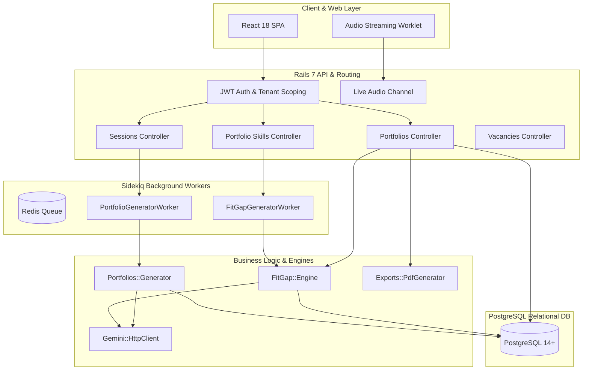
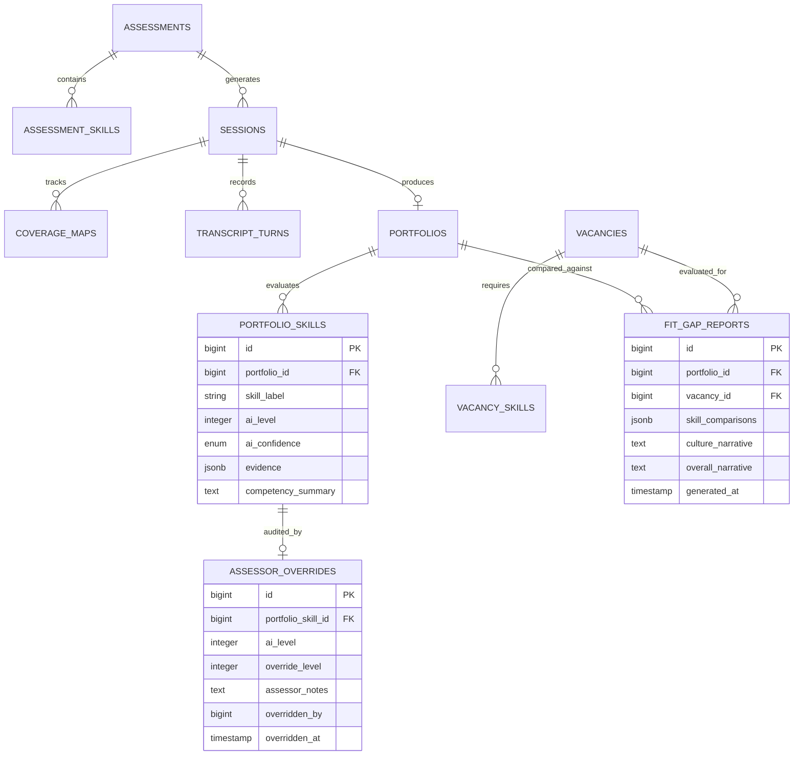

# Backend Architecture & Code Structure Document
## AI Interview Platform API (Ruby on Rails 7 + PostgreSQL + Sidekiq + Gemini AI)

---

## 1. High-Level Architecture & System Design

The backend service is a high-performance **Ruby on Rails 7 (API mode)** application designed for multi-tenant candidate evaluation, real-time audio WebSocket coordination, asynchronous LLM processing via Sidekiq, and deterministic Fit/Gap analysis.



---

## 2. Directory & Module Structure (`api/`)

```
api/
├── app/
│   ├── clients/
│   │   └── gemini/
│   │       ├── http_client.rb         # Faraday HTTP client for Gemini REST API
│   │       └── live_client.rb         # Real-time WebSocket bridge for live audio
│   ├── controllers/
│   │   ├── api/
│   │   │   └── v1/
│   │   │       ├── api_controller.rb              # Base API controller (Auth, Tenant, Responses)
│   │   │       ├── assessments_controller.rb       # Assessment template management
│   │   │       ├── authentication_controller.rb    # Login & JWT token issuance
│   │   │       ├── portfolio_skills_controller.rb  # Assessor override actions & cache sync
│   │   │       ├── portfolios_controller.rb        # Portfolio show, regenerate, fitgap & export
│   │   │       ├── sessions_controller.rb          # Session lifecycle & candidate endpoints
│   │   │       ├── skill_taxonomies_controller.rb  # Reference skill taxonomies
│   │   │       └── vacancies_controller.rb         # Job vacancy & skill requirement CRUD
│   │   └── application_controller.rb
│   ├── models/
│   │   ├── application_record.rb      # Base Active Record model
│   │   ├── assessment.rb              # Assessment template definition
│   │   ├── assessment_skill.rb        # Target skill with L1-L5 behavioral anchors
│   │   ├── assessor_override.rb       # Human assessor score adjustment & audit notes
│   │   ├── coverage_map.rb            # Real-time skill probing coverage state
│   │   ├── fit_gap_report.rb          # Calculated vacancy comparison & AI narratives
│   │   ├── portfolio.rb               # Generated candidate skill portfolio header
│   │   ├── portfolio_skill.rb         # Evaluated skill with AI level, confidence & quotes
│   │   ├── session.rb                 # Interview instance and status state machine
│   │   ├── transcript_turn.rb         # Speech turn text and audio timestamps
│   │   ├── user.rb                    # Assessor and admin accounts
│   │   ├── vacancy.rb                 # Job opening with culture & competency expectations
│   │   └── vacancy_skill.rb           # Required skill level for a vacancy
│   ├── services/
│   │   ├── exports/
│   │   │   └── pdf_generator.rb       # Prawn PDF generation engine
│   │   ├── fit_gap/
│   │   │   └── engine.rb              # Core rule-based matching + narrative generator
│   │   ├── portfolios/
│   │   │   └── generator.rb           # LLM transcript evaluation & quote extraction
│   │   └── sessions/
│   │       └── end_handler.rb         # Session finalization and background job dispatcher
│   └── workers/
│       ├── coverage_analyzer_worker.rb
│       ├── fit_gap_generator_worker.rb     # Async fit/gap report generator
│       └── portfolio_generator_worker.rb   # Async portfolio evaluation worker
├── config/
│   ├── application.yml.sample         # Figaro environment configuration
│   ├── database.yml                   # PostgreSQL database configuration
│   ├── routes.rb                      # RESTful route definitions
│   └── sidekiq.yml                    # Sidekiq worker concurrency & queues
├── db/
│   ├── migrate/                       # Active Record database migrations
│   ├── schema.rb                      # PostgreSQL schema definition with custom enums
│   └── seeds.rb                       # Development and staging seed data
└── spec/                              # RSpec Automated Test Suite
    ├── factories/                     # FactoryBot fixture definitions
    ├── models/                        # Model unit tests
    ├── requests/                      # Request & controller integration tests
    ├── services/                      # Service & engine unit tests
    ├── rails_helper.rb                # Rails RSpec environment configuration
    └── spec_helper.rb                 # RSpec general configuration
```

---

## 3. Relational Schema & Entity-Relationship Model



### Key PostgreSQL Custom Enums & Constraints
* **`confidence_level`**: `high`, `medium`, `low`
* **`fit_result`**: `match`, `gap`, `exceed`, `not_assessed`
* **`generation_status`**: `pending`, `generating`, `complete`, `failed`
* **`session_status`**: `pending`, `active`, `ended`, `failed`
* **Level Constraints**: Check constraints ensure `expected_level`, `ai_level`, and `override_level` are strictly between $1$ and $5$.

---

## 4. Core Business Engines & Service Logic

### 4.1 `FitGap::Engine` (`app/services/fit_gap/engine.rb`)
The `FitGap::Engine` bridges candidate competency with role requirements through a 2-stage evaluation:

1. **Deterministic Rule-Based Level Comparison**:
   * Resolves effective skill levels by checking for `AssessorOverride` first; falls back to `ai_level`.
   * Maps vacancy skills to candidate skills by `skill_id` (primary) or case-insensitive `skill_label` (secondary).
   * Computes $\Delta = \text{effective\_level} - \text{expected\_level}$:
     $$\text{Result} = \begin{cases} \text{match} & \text{if } \Delta = 0 \\ \text{exceed} & \text{if } \Delta > 0 \\ \text{gap} & \text{if } \Delta < 0 \\ \text{not\_assessed} & \text{if candidate skill is absent} \end{cases}$$
2. **LLM-Synthesized Narrative Generation**:
   * Formulates structured prompt to Gemini Flash summarizing matches, exceeds, gaps, and unassessed skills against vacancy culture dimensions.
   * Extracts `culture_narrative` and `overall_narrative`.
   * **Designed Failure Path**: If Gemini call times out or throws an error, generates a deterministic mathematical fallback narrative without crashing.

### 4.2 Assessor Override Synchronization (`app/controllers/api/v1/portfolio_skills_controller.rb`)
* When an assessor overrides a score:
  1. Creates or updates `AssessorOverride` with `overridden_by` and `overridden_at`.
  2. The original `ai_level` on `PortfolioSkill` is **strictly preserved** (audit immutability).
  3. Triggers immediate background invalidation/regeneration of all associated `FitGapReport` records via `FitGapGeneratorWorker.perform_async`.

---

## 5. Security & Indonesian UU PDP Compliance

1. **Data Minimization & Safe Logging**:
   * Sensitive attributes (`candidate_name`, `email`, raw auth tokens) are filtered in `config/initializers/filter_parameter_logging.rb`.
   * Background worker arguments pass only database IDs (`portfolio.id`, `vacancy.id`), never raw payload blobs or candidate PII.
2. **Role-Based API Authorization**:
   * Assessor endpoints are protected with `authorize_auth_token! :assessor`.
   * Candidate endpoints (`/sessions/:token/candidate`, `/sessions/:token/audio_complete`) are strictly scoped by one-time unguessable `invite_token`.

---

## 6. Backend Testing Strategy (`api/spec/`)

* **Unit Specs**: Models (`PortfolioSkill`, `AssessorOverride`, `FitGapReport`) validating numericality, relations, and enums.
* **Service Specs**: `FitGap::Engine` testing all 4 comparison results, override precedence, and fallback narratives.
* **Request Specs**: `PortfoliosController` verifying JSON payloads, 404/422 responses, and Prawn PDF exports.
* **Seeded Fault Validation**: Proves test failure on intentional logic inversion.
