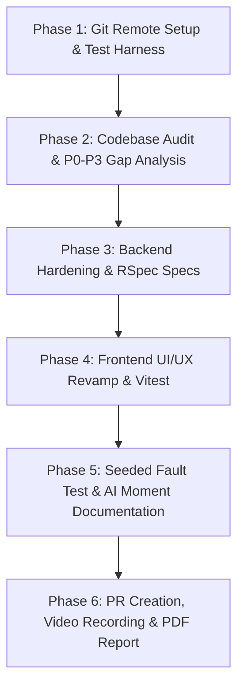

# Step-by-Step Technical Execution Plan: Fullstack Product Engineer Case Study

**Repository:** [https://github.com/ferdianqbl/ai-interview-platform](https://github.com/ferdianqbl/ai-interview-platform) (Forked from `rakamindev/ai-interview-platform`)  
**Target Feature Branch:** `feature/monozukuri-portfolio-and-fitgap-revamp`  
**Evaluation Standard:** Monozukuri Product & Engineering Craftsmanship (50% Product + 50% Engineering)  
**Final Submission Deadline:** Wednesday 19 August, 13:00 WIB  

---

## 1. Overview & Architectural Strategy

This execution plan provides an end-to-end blueprint to take the **AI Interview Platform** from its baseline state to a production-grade, highly reliable, and aesthetically delightful product.

### Core Strategic Focus
1. **The High-Leverage Seam**: Candidate Assessment $\rightarrow$ Portfolio Generation $\rightarrow$ Assessor Overrides $\rightarrow$ Vacancy Fit/Gap Matching $\rightarrow$ PDF/JSON Export.
2. **Engineering Depth**:
   * **Backend Rigor**: Dynamic override synchronization in Fit/Gap, defensive unassessed skill handling, Gemini API fallback narratives, strict data constraints, and a complete RSpec test suite.
   * **Frontend Craftsmanship**: Complete coverage of all 6 interaction states (Loading skeletons, Empty, Error, Partial, Long text overflow, Responsive), modern UI hierarchy, and Vitest component tests.
3. **Mandatory Proofs**: Seeded fault test walkthrough and AI code generation verification case study.
4. **Indonesian UU PDP Compliance**: Strict candidate data privacy, zero PII logging, and human oversight audit trails.

---

## 2. Detailed Execution Roadmap (Phases 1 to 6)

---

### Phase 1: Git Remote Setup & Test Harness Installation

#### 1.1 Git Remote & Branch Configuration
* Configure `origin` to point to the user's fork: `git@github.com:ferdianqbl/ai-interview-platform.git` (or HTTPS).
* Configure `upstream` to point to `git@github.com:rakamindev/ai-interview-platform.git`.
* Create and switch to the feature branch: `feature/monozukuri-portfolio-and-fitgap-revamp`.
* Ensure `main` branch remains untouched.

#### 1.2 Backend Test Harness Setup (`api/`)
* Verify RSpec configuration in `api/`:
  * Create `api/spec/rails_helper.rb` and `api/spec/spec_helper.rb`.
  * Configure `DatabaseCleaner`, `FactoryBot`, `Timecop`, and `Faker`.
  * Create factory definitions in `api/spec/factories/` for:
    - `users`
    - `assessments`
    - `assessment_skills`
    - `sessions`
    - `coverage_maps`
    - `transcript_turns`
    - `portfolios`
    - `portfolio_skills`
    - `assessor_overrides`
    - `vacancies`
    - `vacancy_skills`
    - `fit_gap_reports`

#### 1.3 Frontend Test Harness Setup (`web/`)
* Configure Vitest + `@testing-library/react` + `@testing-library/jest-dom` + `jsdom` in `web/`.
* Add test script to `web/package.json`: `"test": "vitest run"`.
* Configure `web/vitest.config.ts` and `web/src/test/setup.ts`.

---

### Phase 2: Deep Codebase Audit & Problem/Gap Definition

#### 2.1 Fullstack Workflow Walkthrough
* Run full local stack:
  * PostgreSQL database setup and seeds (`rails db:migrate db:seed`).
  * Rails API server on `http://localhost:3001`.
  * Sidekiq worker processing.
  * React Vite frontend on `http://localhost:5173`.
* Step through candidate session $\rightarrow$ portfolio $\rightarrow$ override $\rightarrow$ fit/gap $\rightarrow$ export flows.

#### 2.2 Severity-Ranked Gap Analysis (P0 to P3)
Document all discovered defects into a structured matrix:

| Severity | Category | Flaw / Problem Description | Real-World User Impact | Missing Spec vs. Defective Impl |
|---|---|---|---|---|
| **P0** | Backend/Security | Raw error stack traces or potential candidate PII logged during Gemini worker failures. | Violates Indonesian UU PDP law; security vulnerability. | Defective Implementation |
| **P1** | Backend/FitGap | `FitGap::Engine` does not recalculate or invalidate cached reports when assessor overrides are updated. | Recruiters make hiring decisions based on stale/outdated AI scores. | Missing Specification |
| **P1** | Backend/FitGap | Vacancy skills with no portfolio coverage throw nil delta or unhandled narrative generation failures. | Causes 500 crashes during fit/gap generation for mismatched roles. | Defective Implementation |
| **P2** | Frontend/UI | `PortfolioPage` and `FitGapReportPage` lack dedicated empty states, skeleton loading states, and error retry banners. | Poor user experience; confusing flash of unstyled content or blank page on load. | Missing Specification |
| **P2** | Frontend/UX | Candidate quote evidence with long text strings overflows card containers on tablet/mobile screens. | Unusable evaluation screen on mobile devices; breaks layout. | Defective Implementation |
| **P3** | Frontend/Visual | Color contrast of level badges and delta markers does not follow an intuitive design system hierarchy. | Inefficient cognitive scanning for hiring managers reviewing 50+ candidates. | Missing Specification |

#### 2.3 Constraint Signals (Tech Lead Escalations)
* **Signal 1: Gemini API Rate Limits & Latency**: LLM calls for portfolio and narrative generation can take up to 30–180s. Need robust timeout fallbacks and idempotent Sidekiq retries.
* **Signal 2: Token Management & Shared Secret**: JWT authentication between platform and interview app requires strict secret matching and claims validation.

---

### Phase 3: Backend Hardening & Rigorous Testing (`api/`)

#### 3.1 Solution Option Evaluation & Trade-off Matrix

| Evaluation Dimension | Option A: Dynamic On-The-Fly Calculation | Option B: Event-Driven Materialized Reports (Chosen) |
|---|---|---|
| **Product Impact vs. Cost** | Low cost, but recalculates on every read, slowing down recruiter dashboards. | High impact: immediate sub-100ms response time for recruiters; report regenerated via Sidekiq/sync trigger on override save. |
| **Long-Term Maintainability** | Simple logic, but scatters recalculation triggers across controllers. | Clean separation: `FitGap::Engine` acts as single source of truth; models handle cache invalidation. |
| **Failure Modes** | Database load spikes during peak hiring seasons. | Handled gracefully with fallback narratives if Gemini is unavailable. |
| **Contextual Fit** | Functional for small loads, fails at scale. | **Optimal fit**: Scalable, audit-friendly, fits existing Rails + Sidekiq architecture. |

#### 3.2 Backend Code Modifications
1. **`app/services/fit_gap/engine.rb`**:
   * Ensure `effective_portfolio_skills` accurately maps `assessor_overrides` over `ai_level` while keeping `ai_level` immutable.
   * Add safe handling for unassessed skills (`candidate_level = nil`, `result = 'not_assessed'`).
   * Provide deterministic, structured fallback narratives when Gemini LLM call fails or times out.
2. **`app/controllers/api/v1/portfolios_controller.rb`**:
   * Add cache invalidation or automatic regeneration trigger on override save.
   * Add UU PDP sanitization: ensure no PII or raw secrets appear in JSON error envelopes.
3. **`app/models/assessor_override.rb` & `portfolio_skill.rb`**:
   * Add strict numericality and presence validations (`ai_level: 1..5`, `override_level: 1..5`).

#### 3.3 Backend Automated Test Suite (`api/spec/`)
* **`spec/models/portfolio_skill_spec.rb`**: Model validations and override association tests.
* **`spec/services/fit_gap/engine_spec.rb`**:
  * Exact match, exceed, and gap calculations.
  * Overrides priority verification.
  * Unassessed skill safety.
  * LLM fallback narrative generation under simulated network error.
* **`spec/requests/api/v1/portfolios_controller_spec.rb`**:
  * Authorization tests (Assessor role requirement).
  * Successful portfolio retrieval & regeneration.
  * Fit/gap calculation and PDF/JSON export endpoints.

---

### Phase 4: Frontend Monozukuri Revamp & Component Testing (`web/`)

#### 4.1 UI/UX Enhancements Across All 6 Interaction States
1. **Loading State**:
   * Replace basic spinner with modular Skeleton cards that mirror the exact layout of the portfolio and comparison table.
2. **Empty State**:
   * Add clean illustrated cards when no skills were detected or no vacancies exist.
3. **Error State**:
   * Add actionable error alerts with a "Retry Generation" button and clear diagnostic messages.
4. **Partial Data State**:
   * Add visual badges indicating in-progress skill evaluation or low-confidence AI probes.
5. **Long Text / Overflow State**:
   * Add accordion/expandable quotes with line clamping for candidate transcript excerpts.
6. **Responsive Layout**:
   * Responsive grid: 1 column on mobile (`<640px`), 2 columns on tablet (`<1024px`), 3 columns on desktop (`>=1024px`).

#### 4.2 Component Refinements
* **`SkillPortfolioCard.tsx`**:
  * Distinct color-coded level pills: L1 (Slate), L2 (Blue), L3 (Indigo), L4 (Purple), L5 (Emerald).
  * Direct modal/inline trigger for assessor overrides with note input.
* **`FitGapReportPage.tsx` & `ComparisonTable.tsx`**:
  * Delta badges: Match (`✓ Match`), Exceed (`+X Exceeds`), Gap (`-X Gap`), Not Assessed (`— Not Assessed`).
  * Highlight overridden skills with an "Assessor Adjusted" badge.

#### 4.3 Frontend Unit & Component Tests (`web/src/`)
* **`src/components/portfolio/SkillPortfolioCard.test.tsx`**:
  * Verifies rendering of AI level, confidence badges, evidence quotes, and override button.
* **`src/components/fitgap/ComparisonTable.test.tsx`**:
  * Verifies delta calculation displays, badge styling, and unassessed skill fallback.

---

### Phase 5: Seeded Fault Test & AI Verification Moment

#### 5.1 Seeded Fault Test Experiment
1. **Branch Out**: Create scratch branch `fault/seeded-delta-calculation-bug`.
2. **Inject Fault**: Invert the delta calculation in `FitGap::Engine` (`expected_level - candidate_level`).
3. **Execute Test Runner**: Run `bundle exec rspec spec/services/fit_gap/engine_spec.rb` and capture the explicit test failure output.
4. **Restore & Re-verify**: Switch back to feature branch, verify all specs pass green, and record the git diff/logs.

#### 5.2 AI Verification Moment Documentation
1. **Context**: Describe a real instance during development where AI code generation suggested directly updating the `ai_level` column on `portfolio_skills` during an override instead of creating an audit record in `assessor_overrides`.
2. **Detection & Risk**: Explain how this violates data immutability, destroys the AI baseline, and breaks auditability required by UU PDP regulations.
3. **Resolution**: Explain how the code was revised to maintain strict separation between immutable AI scores and human assessor overrides.

---

### Phase 6: Final Submission Deliverables (PR, Video, PDF Report)

#### 6.1 GitHub Pull Request
* Open a Pull Request from `feature/monozukuri-portfolio-and-fitgap-revamp` to `main` on `https://github.com/ferdianqbl/ai-interview-platform`.
* PR description includes:
  - Problem statement and user impact.
  - Architectural changes across API and Web.
  - Test coverage summary and execution commands.
  - Screenshots of revamped UI states.

#### 6.2 3 to 5-Minute Video Walkthrough Script
* **0:00 - 1:00**: Domain Context (Indonesian hiring challenges, candidate empathy, UU PDP compliance).
* **1:00 - 2:30**: Live Product Demonstration (Portfolio review, assessor override, fit/gap report, export).
* **2:30 - 3:45**: Engineering Craftsmanship (RSpec test harness, Vitest suite, Seeded Fault proof).
* **3:45 - 5:00**: Architecture trade-offs, failure resilience, and live defense summary.

#### 6.3 Single PDF Report Compilation
* Compile `assessment/EXECUTION_REPORT.md` into the final single PDF document containing:
  - PR link and Video Walkthrough URL.
  - Complete written execution narrative.
  - High-resolution visual screenshots.
  - Test outputs and Seeded Fault evidence.

---

## 3. Git Commit Discipline & Execution Steps

We will execute this plan using structured, readable commits:

1. `chore(git): configure remotes and create feature branch`
2. `test(api): setup rspec harness and test factories`
3. `test(web): setup vitest and component testing harness`
4. `feat(api): harden fit_gap engine with overrides sync and fallback narratives`
5. `test(api): add comprehensive rspec tests for models, engine, and controllers`
6. `feat(web): revamp portfolio and fitgap UI across all 6 interaction states`
7. `test(web): add component tests for skill cards and comparison table`
8. `docs(assessment): document seeded fault test and ai verification moment`
9. `docs(assessment): generate full execution report and video walkthrough script`
