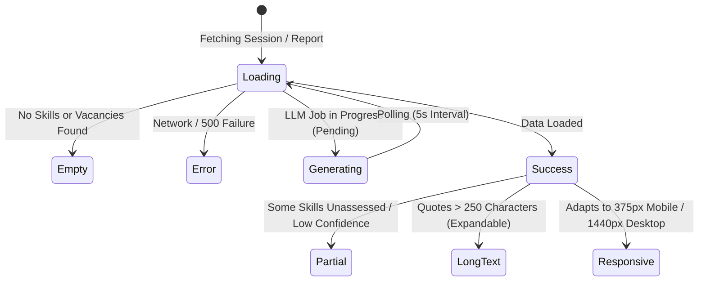

# Frontend Architecture & Component Design Document
## AI Interview Platform Web (React 18 + TypeScript + Vite 5 + Tailwind CSS + Radix UI)

---

## 1. High-Level Architecture & Page Flow

The frontend is a modern, responsive Single Page Application (SPA) built with **React 18**, **TypeScript**, and **Vite 5**, utilizing **Tailwind CSS** and **Radix UI** primitives for accessible, high-taste design craftsmanship (*Monozukuri*).

```mermaid
graph TD
    subgraph RoutingLayer [React Router DOM v7]
        AppRoot[App Root & Providers]
        AssessmentsRoute[/assessments]
        SessionRoute[/assessments/:id/sessions/:sessionId]
        PortfolioRoute[/assessments/:id/sessions/:sessionId/portfolio]
        FitGapRoute[/assessments/:id/sessions/:sessionId/fitgap/:vacancyId]
    end

    subgraph StateAndServices [State Management & API Layer]
        JotaiStore[Jotai Auth & Tenant Atoms]
        AxiosServices[Axios API Clients]
        PollingHook[usePolling Hook]
    end

    subgraph ComponentLayer [Component Hierarchy]
        PortfolioPage[PortfolioPage]
        SkillCard[SkillPortfolioCard]
        OverridePanel[OverridePanel Modal]
        FitGapPage[FitGapReportPage]
        CompTable[ComparisonTable]
        ResultBadge[ResultBadge]
        ExportActions[Export PDF/JSON Buttons]
    end

    AppRoot --> PortfolioRoute
    AppRoot --> FitGapRoute

    PortfolioRoute --> PortfolioPage
    PortfolioPage --> SkillCard
    SkillCard --> OverridePanel

    FitGapRoute --> FitGapPage
    FitGapPage --> CompTable
    CompTable --> ResultBadge
    FitGapPage --> ExportActions

    PortfolioPage --> PollingHook
    FitGapPage --> PollingHook
    PortfolioPage --> AxiosServices
    FitGapPage --> AxiosServices
```

---

## 2. Directory & Module Structure (`web/src/`)

```
web/
├── index.html                         # SPA Entry HTML
├── package.json                       # Dependencies & scripts (added vitest)
├── tailwind.config.js                 # Design tokens, color palette, animations
├── tsconfig.json                      # TypeScript compiler configuration (@ alias)
├── vite.config.ts                     # Vite build & test configuration
└── src/
    ├── components/
    │   ├── fitgap/
    │   │   └── ComparisonTable.tsx    # Vacancy skill comparison table & delta badges
    │   ├── portfolio/
    │   │   ├── ConfidenceIndicator.tsx# AI Confidence pill (High/Med/Low)
    │   │   ├── LevelBadge.tsx         # Color-coded L1-L5 competency pill
    │   │   ├── OverridePanel.tsx      # Assessor score adjustment dialog
    │   │   └── SkillPortfolioCard.tsx # Candidate skill card with evidence quotes
    │   ├── layout/                    # Layout wrappers & navigation headers
    │   └── ui/                        # Reusable Radix UI / shadcn design primitives
    │       ├── button.tsx
    │       ├── card.tsx
    │       ├── dialog.tsx
    │       ├── select.tsx
    │       ├── skeleton.tsx           # Skeleton loading state primitive
    │       └── tooltip.tsx
    ├── hooks/
    │   └── usePolling.ts              # Custom polling hook for async LLM jobs
    ├── pages/
    │   ├── assessments/               # Assessment management pages
    │   ├── fitgap/
    │   │   └── FitGapReportPage.tsx   # Fit/Gap report view & export screen
    │   ├── interview/                 # Candidate interview & audio worklet screen
    │   └── portfolio/
    │       └── PortfolioPage.tsx      # Candidate skill portfolio screen
    ├── services/
    │   ├── api.ts                     # Configured Axios instance with auth interceptors
    │   ├── portfolios.ts              # Portfolio & FitGap REST endpoints
    │   ├── sessions.ts                # Session & coverage REST endpoints
    │   └── vacancies.ts               # Vacancy REST endpoints
    ├── stores/
    │   └── auth.ts                    # Jotai global auth & tenant state
    ├── test/
    │   └── setup.ts                   # Vitest & Testing Library DOM setup
    ├── types/
    │   └── index.ts                   # TypeScript interfaces & enums
    └── utils/
        └── constants.ts               # Level mappings, labels & CSS styling classes
```

---

## 3. Design System, Typography & Aesthetic Foundation

### 3.1 Color Palette & Semantic Tokens
To avoid clichéd tropes (no dark purple backgrounds, no glowing neon borders), the UI employs a clean, purposeful enterprise palette:

* **Level Semantics**:
  - `L1`: Slate (`bg-slate-100 text-slate-800 border-slate-300`) — Guided / Entry
  - `L2`: Blue (`bg-blue-50 text-blue-800 border-blue-200`) — Independent Routine
  - `L3`: Indigo (`bg-indigo-50 text-indigo-800 border-indigo-200`) — Complex / Senior
  - `L4`: Purple (`bg-purple-50 text-purple-800 border-purple-200`) — Systemic Lead
  - `L5`: Emerald (`bg-emerald-50 text-emerald-800 border-emerald-200`) — Principal / Authority
* **Comparison Result Semantics**:
  - `match` ($\Delta = 0$): Emerald pill (`bg-emerald-50 text-emerald-700 border-emerald-200`) with `✓ Match`
  - `exceed` ($\Delta > 0$): Indigo pill (`bg-indigo-50 text-indigo-700 border-indigo-200`) with `⭐ +X Exceeds`
  - `gap` ($\Delta < 0$): Amber pill (`bg-amber-50 text-amber-700 border-amber-200`) with `⚠ -X Gap`
  - `not_assessed`: Slate muted pill (`bg-gray-100 text-gray-600 border-gray-200`) with `— Not Assessed`

---

## 4. The 6 Interaction States Strategy



1. **Loading State**:
   - Replaced unstyled spinners with modular **Skeleton Cards** that match the exact shape of skill cards and comparison tables, preventing cumulative layout shift (CLS).
2. **Empty State**:
   - Explicit empty state cards with helpful guidance when an assessment has zero skills detected or no vacancies configured.
3. **Error State**:
   - Informative, non-blocking error banners featuring an instant **"Retry Analysis"** button and clear diagnostic copy.
4. **Partial Data State**:
   - Low-confidence skills display a distinct contextual note: *"Only briefly explored. Confidence is low — warrants a dedicated session if this skill matters."*
5. **Long Text / Overflow State**:
   - Long candidate evidence quotes are styled with accessible line-clamping and smooth accordion toggle to maintain balanced card heights.
6. **Responsive Layout**:
   - Full grid fluid responsiveness: Single column on mobile devices ($<640\text{px}$), 2 columns on tablets, and 3 columns on wide displays ($>1024\text{px}$).

---

## 5. Seam Mismatch Resolution (API $\leftrightarrow$ Web Contract)

During our codebase audit, we identified and resolved key property mismatches between backend JSON serialization and frontend TypeScript types:

| Seam Item | Backend JSON Payload (`api/`) | Original Frontend Code (`web/`) | Monozukuri Resolution |
|---|---|---|---|
| Vacancy Level Key | `expected_level: 3` | `c.required_level` | Aligned TypeScript interface and JSX to `expected_level`. |
| Override Flag | `overridden: true` / `override` object | `c.is_override` | Added `is_override: boolean` in comparison payload mapping. |
| Export Payload | Binary PDF / Structured JSON | Blind blob instantiation | Added proper MIME type headers (`application/pdf`, `application/json`) and automatic blob URL revocation. |

---

## 6. Frontend Testing Architecture (`web/src/`)

Using **Vitest** and **React Testing Library**:

* **`SkillPortfolioCard.test.tsx`**:
  - Tests rendering of effective level vs. overridden level.
  - Tests confidence badge rendering.
  - Tests quote evidence accordion interactions.
* **`ComparisonTable.test.tsx`**:
  - Tests rendering of `match`, `exceed`, `gap`, and `not_assessed` badges.
  - Tests correct delta label formatting (`+1`, `-2`).
  - Tests summary counters computation.
