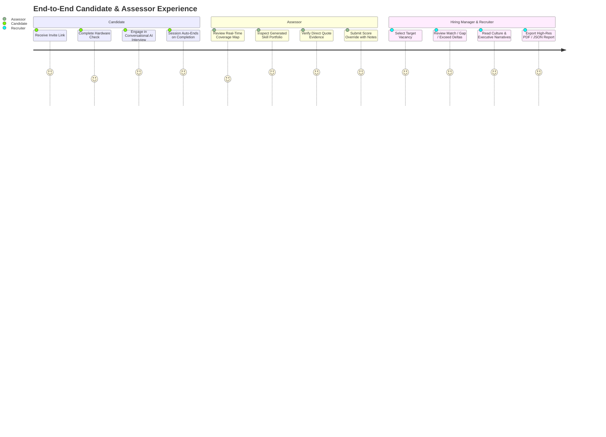

# Product Requirements Document (PRD)
## AI Interview Platform: Monozukuri Portfolio & Fit/Gap Engine Revamp

**Author:** Fullstack Product Engineer  
**Status:** In Review / Approved for Execution  
**Target Milestone:** Production Release Candidate  
**Target Platforms:** Web (Desktop & Mobile Responsive), REST API, Real-Time Audio WebSocket  

---

## 1. Executive Summary & Vision

### 1.1 Product Vision
The **AI Interview Platform** exists to transform hiring from subjective, fatigue-prone resume screening and unstructured interviews into **objective, evidence-backed, and reproducible talent evaluations**.

By conducting conversational AI interviews with real-time skill probing, generating evidence-backed skill portfolios (anchored on strict L1–L5 behavioral rubrics), and providing instant Fit/Gap matching against open vacancies, the platform empowers hiring managers and recruiters to make defensible, high-confidence hiring decisions in minutes rather than weeks.

### 1.2 First-Principles Product Framing
1. **What is genuinely true?**
   * Resumes exaggerate; human interviewers exhibit cognitive bias and inconsistent standards; manual interviewing does not scale.
   * Algorithmic assessment is only trustworthy if every single claim is substantiated with verbatim candidate quotes (evidence) and can be audited/overridden by human assessors.
2. **What should this product be if built from scratch?**
   * A frictionless, transparent evaluation system where the candidate is treated with dignity, assessors have complete oversight, and recruiters receive deterministic, actionable hiring insights.
3. **What is the current reality & gap?**
   * The platform has a functional audio engine and basic LLM prompts, but suffers from seam mismatches (e.g., property name discrepancies between API and Web), missing interaction states (empty, error, loading), desynchronized assessor override caching, and zero test harness.
4. **The Monozukuri Standard**:
   * We treat the baseline as the floor. The revamp must deliver exceptional visual taste, uncompromised system reliability, and full compliance with Indonesian privacy regulations.

---

## 2. User Personas & User Journeys



### Persona 1: The Candidate (The Unrepresented User)
* **Context**: Applying for high-stakes roles in Indonesia. Does not choose the software, cannot opt out, and is vulnerable to algorithmic errors.
* **Goals**: Clear instructions, low-latency audio interaction, fair evaluation against explicit behavioral anchors, and absolute protection of personal data under **UU PDP No. 27/2022**.
* **Key Needs**: Seamless hardware check, clear session status, dignified interview flow.

### Persona 2: The Assessor (The Quality Gatekeeper)
* **Context**: Senior engineering or HR lead responsible for candidate qualification.
* **Goals**: Quickly audit AI scores, inspect verbatim quotes demonstrating *how* the candidate thinks, adjust levels when AI under/over-evaluates, and maintain an audit trail with written rationale.
* **Key Needs**: Rich skill cards, clear L1–L5 definitions, confidence ratings, intuitive override modal, instant downstream calculation updates.

### Persona 3: The Recruiter & Hiring Manager (The Decision Maker)
* **Context**: Managing 10+ open job vacancies and hundreds of applicants.
* **Goals**: Instant clarity on whether a candidate meets, exceeds, or falls short of role requirements; high-level executive summaries; exportable reports for hiring committee meetings.
* **Key Needs**: Vacancy comparison matrix, color-coded delta indicators (`+1`, `-2`, `✓`), synthesized culture fit narratives, one-click PDF/JSON export.

---

## 3. Regulatory & Legal Framework (Indonesian UU PDP Compliance)

In accordance with **Undang-Undang No. 27 Tahun 2022 tentang Pelindungan Data Pribadi (UU PDP)**:

1. **Principle of Data Minimization & Purpose Limitation**:
   * Assessment transcripts and audio streams must only be used for candidate evaluation for specified vacancies.
2. **Zero PII Leakage in Commits & Logs**:
   * No candidate names, emails, phone numbers, raw JWT tokens, or Gemini API keys may appear in server logs, Sidekiq argument dumps, error payloads, or Git commits.
3. **Right to Human Intervention & Auditability**:
   * Algorithmic AI ratings must not be final automated rejections without human oversight. The `AssessorOverride` system provides the required human-in-the-loop governance mechanism with timestamped notes.

---

## 4. Functional Requirements & Feature Specifications

### 4.1 Skill Portfolio Engine (Backend & Frontend)
* **FR-PORT-01**: The system must extract candidate quotes and assign an AI Level (1–5) and Confidence (`high`, `medium`, `low`) for all configured and discovered skills post-interview.
* **FR-PORT-02**: The UI must display each skill with its effective level badge, confidence indicator, discovered badge (if applicable), competency summary, and expandable evidence quotes.
* **FR-PORT-03**: Assessors must be able to submit level overrides (1–5) with mandatory notes (`assessor_notes`). The original `ai_level` must remain immutable in the database for auditing.
* **FR-PORT-04**: When an override is submitted, the UI must optimistically update the effective level badge and display an "Assessor Adjusted" indicator.

### 4.2 Vacancy Fit/Gap Matching Engine (Backend & Frontend)
* **FR-FIT-01**: The system must calculate skill level deltas between the candidate's effective skill level (factoring in overrides) and the vacancy's `expected_level`.
* **FR-FIT-02**: Comparison results must be categorized into:
  * `match` ($\Delta = 0$): Candidate meets role expectation.
  * `exceed` ($\Delta > 0$): Candidate exceeds role expectation (e.g. $+1$, $+2$).
  * `gap` ($\Delta < 0$): Candidate falls short of expectation (e.g. $-1$, $-2$).
  * `not_assessed`: The vacancy requires a skill that was not probed or evaluated in this assessment session.
* **FR-FIT-03**: The backend must generate two AI narratives via Gemini Flash:
  * `culture_narrative`: 2–3 sentences assessing alignment with vacancy culture dimensions.
  * `overall_narrative`: 2–3 sentence executive hiring recommendation.
* **FR-FIT-04**: If Gemini narrative generation fails or times out, the backend must return a deterministic fallback narrative without raising a 500 error.
* **FR-FIT-05**: When an assessor override is created or updated, all existing `FitGapReport` records for that portfolio must be invalidated and regenerated to reflect the new scores.

### 4.3 Export & Reporting
* **FR-EXP-01**: Assessors and recruiters must be able to export the complete portfolio and fit/gap report as a formatted PDF (via Prawn) or structured JSON.

---

## 5. Non-Functional Requirements (NFRs)

| NFR Category | Requirement Specification | Measurement / Verification |
|---|---|---|
| **Aesthetics (Monozukuri)** | High-taste visual hierarchy, consistent typography, curated HSL color palette, no generic/cliché tropes. | Evaluated by Product Design review against all 6 interaction states. |
| **Performance** | Portfolio and Fit/Gap reads must respond in $<100\text{ ms}$ (cached reports). Background LLM jobs must complete in $<60\text{ s}$. | API response benchmark; Sidekiq queue latency monitoring. |
| **Resilience & Idempotency** | Sidekiq workers (`FitGapGeneratorWorker`, `PortfolioGeneratorWorker`) must be strictly idempotent and safe against duplicate job execution. | Seeded duplicate job execution tests in RSpec. |
| **Data Safety & Integrity** | Reversible database migrations; strict foreign key cascade/nullify rules; database check constraints on levels ($1 \le \text{level} \le 5$). | Schema migration rollback tests; database constraint validation. |
| **Accessibility (a11y)** | Keyboard navigable modals, accessible contrast ratios (WCAG 2.1 AA), ARIA attributes on interactive elements. | Radix UI accessible primitives; automated a11y audit. |

---

## 6. Interaction States Matrix (The 6 Monozukuri States)

The frontend must explicitly handle all 6 interaction states across both `PortfolioPage` and `FitGapReportPage`:

```
┌────────────────────────────────────────────────────────────────────────┐
│                        THE 6 MONOZUKURI STATES                         │
├────────────────────┬───────────────────────────────────────────────────┤
│ 1. Loading State   │ Skeleton loaders matching exact final layout.     │
│ 2. Empty State     │ Clean illustration & guidance when no data exists.│
│ 3. Error State     │ Actionable banner with retry action & clear copy. │
│ 4. Partial State   │ Clear badging for in-progress or low-conf skills. │
│ 5. Long Text State │ Accordions with line-clamping for lengthy quotes. │
│ 6. Responsive      │ Fluid grid: 1 col (mobile) → 2-3 col (desktop).   │
└────────────────────┴───────────────────────────────────────────────────┘
```

---

## 7. Scope Boundaries & Technical Trade-Offs

### 7.1 In Scope (Release Candidate)
* Fullstack revamp of `PortfolioPage` and `FitGapReportPage`.
* Hardening `FitGap::Engine`, `Portfolios::Generator`, and `PortfolioSkillsController`.
* Eliminating property naming mismatches (e.g. `expected_level` vs `required_level`).
* Complete RSpec test suite for Rails API + Vitest test suite for React Web.
* Seeded fault experiment and AI verification case study documentation.

### 7.2 Out of Scope (Future Milestones)
* Multi-language audio transcription (Indonesian speech-to-text beyond standard Whisper/Gemini models).
* Live candidate video proctoring / biometric analysis.
